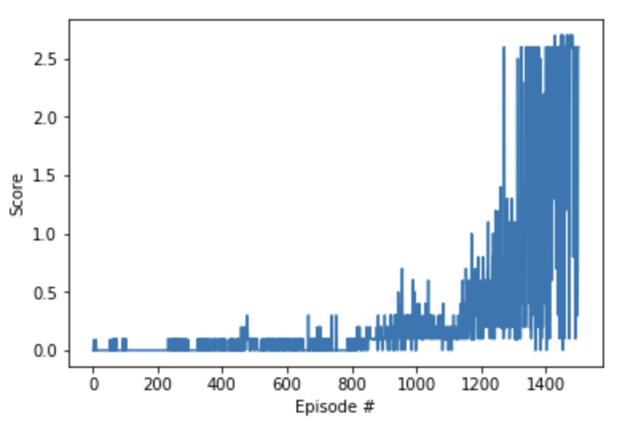

# Project Report

## Learning Algorithm
Reinforcement learning algorithms can be categoized as either **value-based**, **policy-based** or combination of the two. **Value-based** learning consists of learning a state-action value function (*Value/Q-function*) that leads to the **highest-valued state**, by contrast, the **policy-based** approach tries to directly learn a (optimal) policy function directly (without the intermediary *Value/Q-function*).

- In the [first assignment](https://github.com/ZenithSun/Banana_Navigation/blob/master/Report.md) we used a *value-based* algorithm, [**Deep Q-Network (DQN)**](https://deepmind.com/research/dqn/), to successfully train an agent to navigate an environment scattered with *good* and *bad* bananas. DQN has seen much success dealing with environments with high-dimensional (complex) states but only dealing with discrete actions. 

- In the [second assignment](https://github.com/ZenithSun/Continuous_Control/blob/master/Report.md), we already used [**Deep Deterministic Policy Gradient (DDPG)**](https://arxiv.org/pdf/1509.02971.pdf) to successfully train a double-jointed arm to maintain its position at the target location for as many time steps as possible.

In this third project, we are still going to use the same method to train our agent. For the completeness, we will write a recap of the keys points of **DDPG**. An **actor** is used to tune the parameters 𝜽 for the policy function i.e. decide the best action for a specific state while a **critic** is used to evaluate the policy function estimated by the actor according to the temporal difference (TD) error (*TD learning is a way to learn how to predict a value depending on future values for a given state, similar to Q-Learning*). 
[**Deep Deterministic Policy Gradient (DDPG)**] (the algorithm used in this project) introduces an **actor-critic architecture** to deal with a large action space (continous or discrete). An **actor** is used to tune the parameters 𝜽 for the policy function i.e. decide the best action for a specific state while a **critic** is used to evaluate the policy function estimated by the actor according to the temporal difference (TD) error (*TD learning is a way to learn how to predict a value depending on future values for a given state, similar to Q-Learning*). The combinination of these two networks (Actor and Critic) is a great methodology to control both the **bias** and the **variance** as Value-Based temporal difference(TD) method itself could leads to the large bias, while policy based method itself usually can get large variances.

## Model Architecture and Parameters
- **Actor Network:** 

8(*Observation Input*) -> 256(*fully connected hidden layer*) -> 2(*Actions Output*)

- **Critic Network**

8(*Observation Input*) -> 256(*fully connected hidden layer1*) + 2(*Actions Output*) ->

256(*fully connected hidden layer2*) -> 128(*fully connected hidden layer2*) -> 1(*Output*)

- **Hyperparameters**

replay buffer size = 1e6  
minibatch size = 1024  
discount factor = 0.99  
tau for soft update of target parameters = 1e-3  
learning rate of the actor = 1e-4  
learning rate of the critic = 1e-3  
L2 weight decay = 0  

## Training Result

The agent was able to solve the task (gets an average score of +0.5 over 100 consecutive episodes, after taking the maximum over both agents) in 1301 episode. During episodes between 1400 to 1500, the average score reaches 1.94, which is much better than the minimum requirement.

## Future Improvements and Plans
- **Implement some other Actor-Critic Methods** &mdash; For example: [A3C](https://arxiv.org/pdf/1602.01783.pdf), [A2C](https://github.com/openai/baselines/tree/master/baselines/a2c) and [GAE](https://arxiv.org/pdf/1506.02438.pdf). 
- **Use tensorflow framework to impletement Actor-Critic Methods** &mdash; Let myself become familiarized with different deep learning package frameworks is always fun and important.
